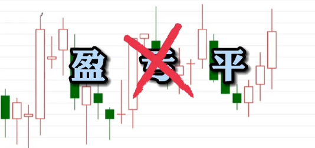
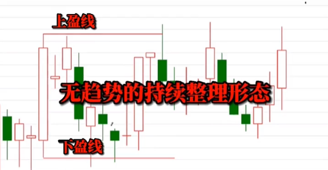
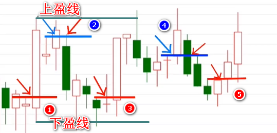
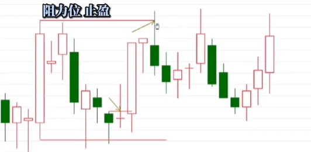
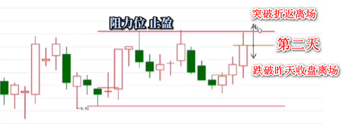
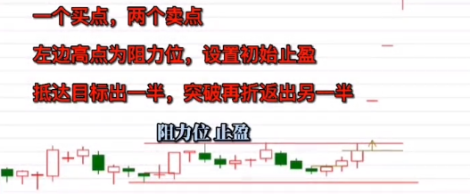

# 盈线基础

盈线之外任何交易方法的进场，其结果无外乎三种情况：盈、亏、平。而从理论上说，盈线相比其它模式少了一种结果，就是没有亏。凡使用盈线交易做亏的，无外乎两种情况，一是你不懂、二是你主动性亏损。

## 1. 什么是盈线？

把任何一根 K 线的最高和最低分别画上两条水平线，上面这条叫**上盈线**，下面这条叫**下盈线**，注意这里说的 K 线是不分阴阳的。

## 2. 如何解读上盈线和下盈线？

当市场价格突破左边那根 K 线的上盈线的时候，盈线交易者认为行情将出现上涨。  
反之当市场价格跌穿了左边那根 K 线的下盈线的时候，盈线交易者认为市场将出现下跌。  
第三种当市场价格在上下盈线之间（又叫**包含线**内）波动的时候，叫做无趋势的整理形态。

**以上就是盈线的基础理论，记住它是理论并不是交易方法。盈线的交易方法是基于盈线的思想认知而来。**

## 3. 盈线为什么不会亏？

因为我们的**进场是在趋势的拐点**，什么样的标的才会入我的法眼？首先一条它必须是下跌的，否则它就谈不上趋势的拐点是吧。

比如这里前面是跌的吧（1红）；又比如这里（2蓝），这时候都看出来第二天跌了，那你看你能不能平是吧，你不走那是你的原因对吧；好继续看这里（3红）是不是拐点；接着这里（4蓝）又是拐点，第二天阴线能不能平；再往后这里（5红），拐点又出现了。

好讲到这里我前面说的都是什么？盈线不会亏，在这张图里，我们操作了 5 笔，你会发现蓝色的进场其结果都是平的，这只不过是我们的一个演示。在我们的实际操作中，蓝色我们是不进场的。这里引出了我们盈线在操作中的一个重要概念：**包含线**。

上一节我们将在上下盈线之间叫无趋势的持续整理形态，只要它的空间足够大，我们就可以做其中的波段，做包含线之内的波动。

首先我们考虑的就是性价比，何为性价比？就是过左边上盈线之后，上下空间的对比。有了这一概念，在这里（2、4）你是不能进场的，因为它上下空间的对比明显是不合适的。正确的进场点应该是3、4，性价比至少要够 大，如 5 处目测它的性价比是 3 比 2。

**总结：**

1. 盈线为什么不会亏。
2. 包含线。
3. 进场和性价比的关系。

## 4. 怎么止盈？

在进场之前你就要打量，打量什么？性价比对吧，通过上下打量，你就得到了止盈和止损，我们的初始止盈，一般就设在左边前期的高点，当价格抵达这个阻力位的时候，保守的盈线交易者出一半，当它突破了这个阻力位，折返跌穿的那一刻，我们要出掉剩余的部分：

接下来在我们第二次进场的时候，因为前两次都创出了同样的新高，所以我们要调整我们的目标位，这时候问题来了，它**没有抵达目标位就已经回撤了**，这时候无论是保守派还是激进派，它都**没有一个出场的理由**，由此我们要**做第二天的交易计划**。为了保护我们的利润，我们在收盘的位置画一条止盈线，如果它第二天跌穿了这条止盈线，我们就离场，反之如果它没有跌穿而是转身向上，我们就采用先前的策略突破折返离场。做好了计划我们就等待明天：

来源：

- 盈线基础（一）<https://weibo.com/tv/show/1034:4649361519607906>
- 盈线基础（二）<https://weibo.com/tv/show/1034:4649362513657872>
- 盈线基础（三）<https://weibo.com/tv/show/1034:4650455549280335>

[video](./01-盈线基础.mp4)

> @RJ 