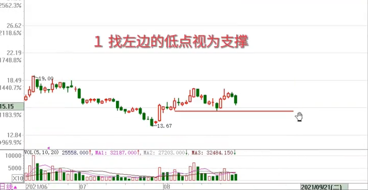
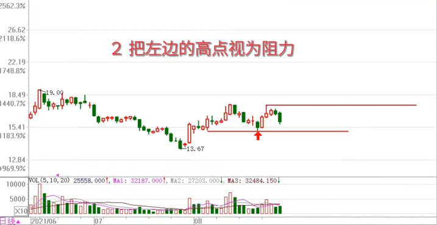
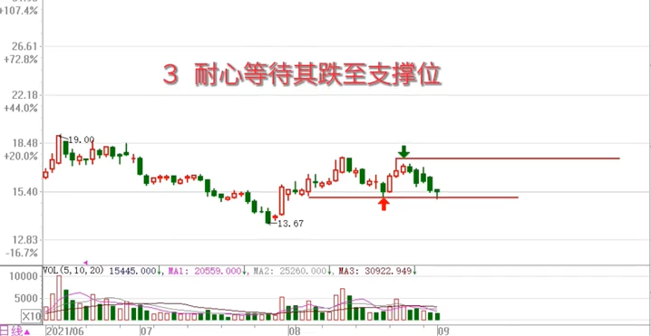
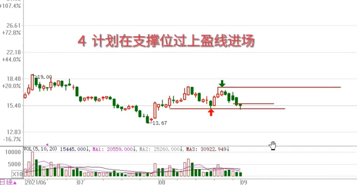
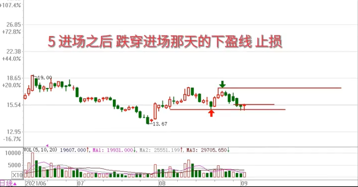
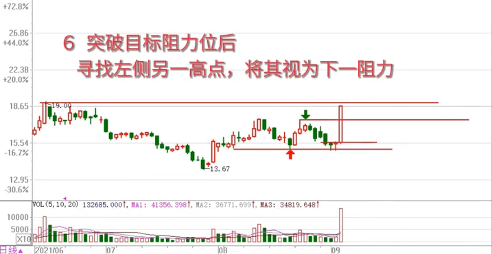
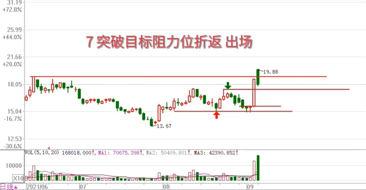
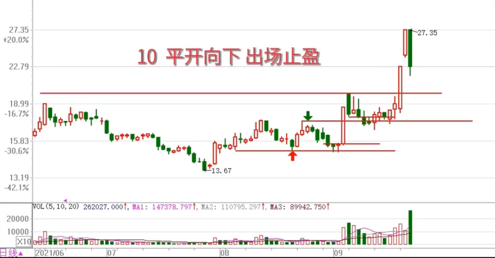

# 盈线基本操作法步骤图解

1. 找左边的低点视为支撑
2. 把左边的高点视为阻力
3. 耐心等待其跌至支撑位
4. 计划在支撑位过上盈线进场
5. 进场之后 跌穿进场那天的下盈线止损
6. 突破目标阻力位后，寻找左侧另一高点，将其视为下一阻力
7. 突破目标阻力位折返 出场
8. 下跌调整后，视其空间高度决定是否再次进场
9. 再次涨停后，通过保护涨停来确保即得收获
10. 平开向下，出场止盈

炒股的真谛：树叶过河，全凭一股浪劲

刚达阻力位，保守的可先出一半！

来源：<https://www.douyin.com/video/7028427579321257254>

[video](./02-盈线基本操作法步骤图解.mp4)

> @RJ