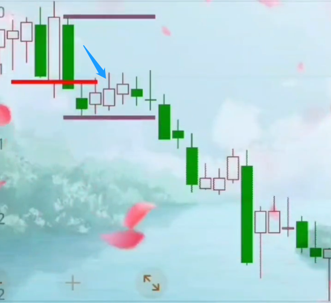
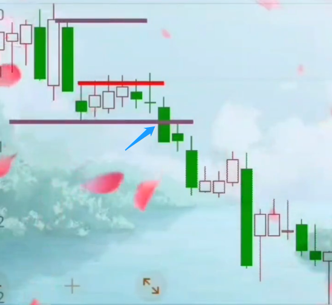
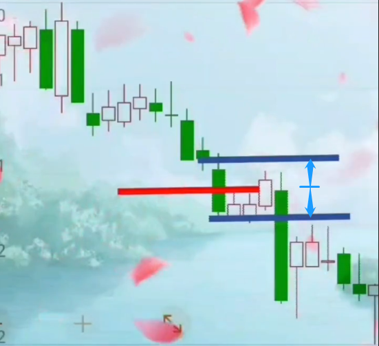
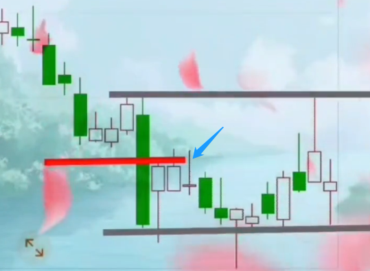
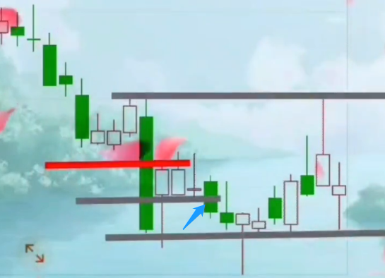
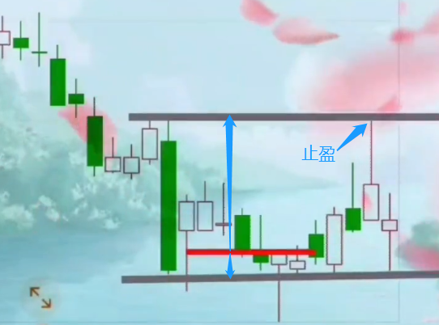
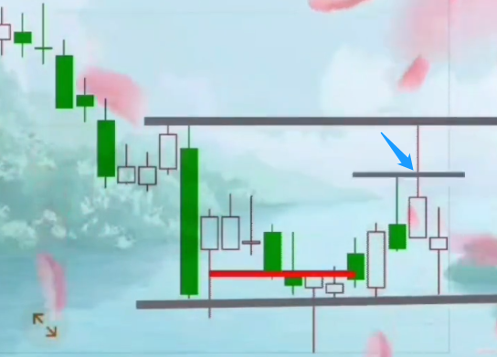
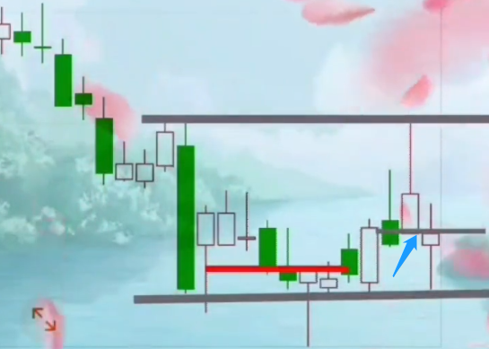

# 图例讲解盈线

## 第二天返回进场点平仓走：

## 跌破下盈线止损走：

> 跌破下盈线应该毫不犹豫的斩仓！  
> 为什么叫下盈线？就是说跌穿了我也赢，对吧。你看后面的走势，你是不是赢的？哎！就那么气人，咱总是赢的。

## 上下空间性价比不够不进：

> 你得衡量利弊，性价比，你看它就在中间。如果你非得做，那第二天破了你的成本线是不是该走了，破了下盈线没有商量余地必须离场。

## 破了下盈线后，接着我们就是重新画上下盈线：

> 这里实际和前面一样，它也到了包含线一半的位置，你可以进，但第二天破了成本你可以出。

## 如果还不出，那第三天跌破了它的下盈线你就该走：

## 紧接着好戏上演，跌穿了下盈线返回：

> 这个时候空间够没够？够了！对吧？这时候你就要进场满上。  
> 你满上之后，当天套了，第二天阴线，第三天低开。这三天是不是特别熬人？  
> 如果你是本着保护成本的思想，这三天你已经平仓出场了。  
> 如果你是另一种思维，以下盈线为底线，那你就能等到后面的结果。  
> 这两种做法都没有错。每个人状况不同，他的包容度也不同，临盘要根据自己的情况去选择采用哪种方法。  
> 后面到包含线的上盈线你就可以止盈了。

## 如果你不止赢，折返跌穿左边那颗线的高点出场：

## 如果你还不出场，那就在今天跌穿了下盈线出场：

来源：<https://weibo.com/tv/show/1034:4608539847753731>

[video](./03-图例讲解盈线_20210225.mp4)

> @RJ 
